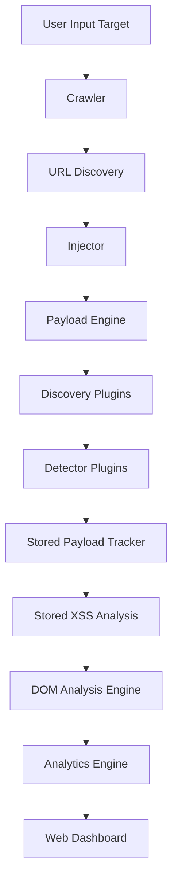
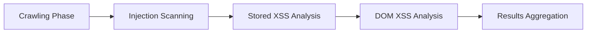
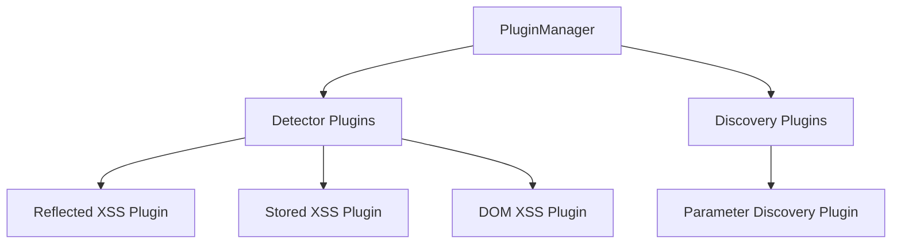

# VulScanWare

VulScanWare is a modular web vulnerability scanning framework focused on Cross-Site Scripting (XSS) detection with a plugin-driven architecture.

It combines adaptive payload injection, browser-based DOM analysis, and real-time vulnerability analytics through a web dashboard.

The framework is designed for:

    Security researchers
    Application security engineers
    Vulnerability scanner developers
    Offensive security training environments

---

## Key Features

#### Modular Plugin Architecture

VulScanWare uses a dynamic plugin loading system that allows new detectors or discovery modules to be added without modifying the core engine.

Plugins automatically register themselves when the scanner starts.

---

### Multiple XSS Detection Techniques

    Detection Type	    Method
    Reflected XSS	    Payload injection + response analysis
    Stored XSS	        Payload fingerprint tracking + secondary crawl
    DOM XSS	            Browser instrumentation with Playwright

---

### Adaptive Payload Injection

**Payloads are injected into:**

    URL parameters
    HTML forms
    input fields
    query strings

**Payloads are fingerprinted with tokens such as:**

    VSW_A92F7K

These tokens allow the scanner to detect:

    stored payload reflections
    duplicate vulnerabilities
    injection origin

---

### Real-Time Web Dashboard

The web interface provides live scanning analytics including:

    vulnerability feed
    attack surface metrics
    severity distribution
    endpoint risk ranking
    vulnerability heatmap
    scan progress visualization
    AI remediation suggestions

---

## Architecture Overview

---

## Scanning Pipeline

**The scanner operates in four sequential phases.**

---

### Phase 1 — Crawling

The crawler discovers URLs and builds the target attack surface.

**Capabilities include:**

    link discovery
    form detection
    query parameter extraction
    depth-limited crawling
    URL deduplication

---

### Phase 2 — Injection Scanning

Payloads are injected into parameters and forms.

**Each injection produces an object:**

    {
      url
      method
      parameter
      payload
      token
    }

Detector plugins analyze responses to identify reflected vulnerabilities.

---

### Phase 3 — Stored XSS Analysis

Injected payload fingerprints are tracked during scanning.

After scanning completes, the crawler performs a second crawl to detect stored payloads rendered by the application.

**This allows detection of:**

    comment injection
    stored form payloads
    persistent XSS vectors

---

### Phase 4 — DOM XSS Analysis

DOM-based vulnerabilities are detected using browser instrumentation.

**The scanner hooks common JavaScript sinks:**

    alert
    confirm
    prompt
    eval
    innerHTML
    document.write

This phase runs inside a headless Chromium browser.

------

### Phase 5 — AI Remediation

Optional Context Aware AI Remediation. 
The scanner loads vulnerable pages to AI remediation panel:

**AI Remediation Prompt**

    ### Explanation
    Explain why this vulnerability is dangerous.
            
    ### Impact
    Describe what an attacker could do.
    
    ### Secure Fix
    Provide specific remediation steps.
    
    ### Secure Code Example
    Show a short secure coding example if applicable.
    
    ### Prevention Checklist
    Provide 3–5 best practices developers should implement.

This phase runs after scanning completion. It's optional

---

## Plugin Architecture

The scanner’s extensibility comes from its plugin system.

Plugins are dynamically loaded from the plugin directory.

---

### Plugin Directory Structure

    core/plugins/
        base.py
        manager.py
    
        detectors/
            reflected.py
            stored.py
            dom.py
    
        discovery/
            param_discovery.py

---

## Plugin Flow

    flowchart TD
    
    A[Injection Object]
    
    A --> B[Plugin Router]
    
    B --> C[Reflected Detector]
    B --> D[Stored Tracker]
    B --> E[DOM Detector]
    
    C --> F[Vulnerability Found]
    D --> F
    E --> F
    
    F --> G[Result Aggregation]

---

## Detector Plugin Example

Plugins inherit from PluginBase.

**Example structure:**
    
    from core.plugins.base import PluginBase
    
    class ExamplePlugin(PluginBase):
    
        plugin_type = "detector"
    
        def run(self, injection):
            ...

The plugin manager automatically loads it during startup.

---

## Core Components

### Crawler

Responsible for discovering URLs and forms.

**Capabilities:**

    depth-limited crawling
    form extraction
    parameter discovery
    attack surface expansion

---

### Injector

Injects payloads into discovered parameters.

**Injection targets include:**

    GET parameters
    POST form fields
    HTML input fields

---

### Payload Engine

**Handles:**

    payload mutation
    context targeting
    payload fingerprinting
    adaptive payload selection

---

### Detector Plugins

Detector plugins analyze injection responses.

**Examples:**

    ReflectedXSSDetector
    StoredXSSTracker
    DOMXSSDetector

---

### Stored Payload Tracker

Tracks payload tokens injected during scanning and verifies their appearance in later responses.

This enables detection of persistent vulnerabilities.

---

### DOM Analysis Engine

Runs a headless browser to detect DOM XSS using JavaScript hook instrumentation.

---

### Analytics Engine

**Aggregates vulnerability data and calculates:**

    threat index
    attack surface score
    severity distribution
    endpoint risk ranking

---

## Threat Scoring

Severity is calculated using contextual rules.

    Severity	Example Payload
    
    Critical	Stored XSS
    High	    
    [CRITICAL] Stored XSS → /comments
    [CRITICAL] DOM XSS → JS sink triggered: innerHTML

---

## Performance Optimizations

**VulScanWare includes several scanning optimizations:**

    detector execution caching
    plugin scope routing
    payload fingerprint tracking
    vulnerability deduplication
    adaptive payload mutation

---

## Contributing

Contributions are welcome.

Development Setup

    git clone repo
    pip install -r requirements.txt

Run tests:

    pytest

---

### Adding a Plugin

Create a plugin file in:

    core/plugins/detectors/

Example:

    class SQLInjectionPlugin(PluginBase):

        plugin_type = "detector"
    
        def run(self, injection):
            ...

The scanner will automatically load the plugin.

---

## Roadmap

**Future improvements include:**

    SQL injection detection
    CSP bypass analysis
    HTTP security header scanning
    distributed scanning engine
    parallel scanning pipeline
    vulnerability export formats

---

## Security Notice

VulScanWare is intended for authorized security testing and research only.

Do not use this tool against systems without explicit permission.

---

License

MIT License

---

## Acknowledgements

Inspired by scanning architectures used in:

    OWASP ZAP
    Burp Suite
    modern modular vulnerability scanners

---